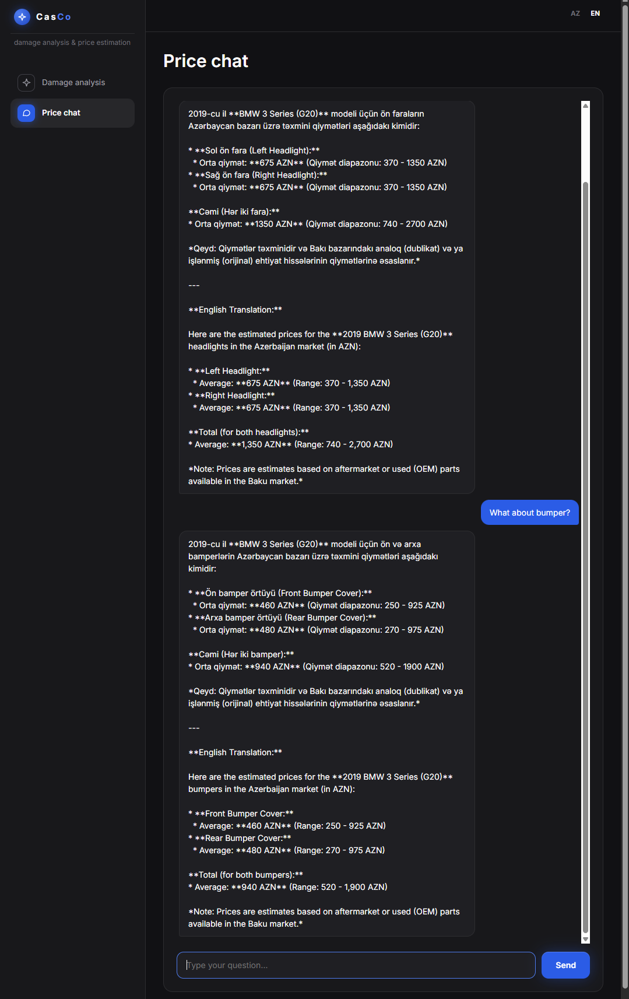

# CasCo 🚗💥


**CasCo** analyzes a photo of a damaged car and produces an **itemized repair-cost estimate calibrated to the Azerbaijani (Baku) market**. Two computer-vision models work together — one identifies **which part** is damaged, the other classifies the **type of damage** (scratch / dent / crack / …). A fusion step maps each damage onto the part it sits on, a recommendation engine decides **repair vs. replacement**, and prices come from a local parts + labor database — never from the language model.

The project ships **two independent entry points over one shared pricing core (`PriceDB`)**:

1. **CV pipeline** — photo → 2 YOLO11-seg models → IoU fusion → repair/replace → priced report. No LLM involved.
2. **Price chat agent** — natural-language (Azerbaijani) part lookup via Gemini 2.5 Flash function-calling. The LLM only extracts `brand/model/year/part_codes` and formats the reply; **all arithmetic is deterministic Python**.

Both are exposed as CLIs **and** over HTTP through a bundled **FastAPI web app**.

---

## Why two models

A single flat model that mixes part and damage into one label set (e.g. `bonnet-dent`, `bumper-damage`) is data-hungry, class-imbalanced, and usually collapses damage into just "dent" — losing `scratch` and `crack`. CasCo splits the problem into two **single-task** segmentation models, each trained on clean data:

- **Part model** → *which* panel is damaged (`front_bumper`, `hood`, `front_door`, …)
- **Damage model** → *what kind* of damage (`scratch`, `dent`, `crack`, `glass shatter`, `lamp broken`, `tire flat`)

Segmentation masks (not boxes) let the fusion step assign damage to the correct part precisely, and each model can be improved independently. This is both **more accurate** and the only way to get the damage **type**, which drives the repair-vs-replace decision.

---

## Current Status

| Component | Status | Notes |
| --- | --- | --- |
| Parts price database | ✅ Working | `car_parts_prices.csv` — 6923 rows: 59 models × generations × parts, min/avg/max AZN |
| Repair / labor price table | ✅ Working | `repair_prices.csv` — Baku rates + premium-brand labor factor |
| Price lookup engine (`PriceDB`) | ✅ Working | year → generation resolution, fuzzy part-code matching |
| Text price agent (Gemini 2.5 Flash) | ✅ Working | natural-language part → price + total, function-calling |
| Part segmentation model | ✅ Working | fine-tuned `yolo11n-seg` → carparts-seg (`parts_best.pt`) |
| Damage-type model (scratch/dent/crack) | ✅ Working | CarDD YOLOv11-seg checkpoint, 6 classes (`cardd_best.pt`) |
| Mask fusion (damage → part) | ✅ Working | IoU overlap, severity from affected-area ratio, orphan handling |
| Recommendation engine (repair vs replace) | ✅ Working | per-damage decision + cost, savings vs full replacement |
| Annotated overlay (`annotate.py`) | ✅ Working | part masks + labelled damage masks drawn back onto the photo |
| Full image pipeline | ✅ Working | image → 2 models → fusion → recommendation → report/JSON |
| Train & eval (baseline vs fine-tune) | ✅ Working | writes precision / recall / mAP comparison CSV |
| FastAPI web app | ✅ Working | upload photo → annotated result + estimate; AZ price chat |
| Live / mobile capture | 📋 Planned | phone photo → instant estimate |

> The deterministic components (price DB, fusion, recommendation, annotation, pipeline wiring) each carry an offline self-test (`--selftest` / `--test` or the module's `__main__` block), so the whole core can be verified without a GPU or API key.

---

## Repository layout

```
casco/
├── car_price_agent.py      # PriceDB (shared pricing core) + Gemini 2.5 Flash chat agent
├── pipeline.py             # full image → estimate pipeline (2 models)
├── fusion.py               # maps damage masks → part masks (IoU) + severity + multi-photo dedup
├── recommendation.py       # repair vs replace decision + cost
├── annotate.py             # OpenCV overlay: part masks + labelled damage masks
├── train_and_eval.py       # Colab training + baseline vs fine-tune metrics
├── webapp/
│   ├── app.py              # FastAPI: /api/analyze, /api/chat, /api/catalog
│   └── static/             # vanilla HTML/CSS/JS frontend (AZ/EN)
├── car_parts_prices.csv    # part replacement prices (AZN)
├── repair_prices.csv       # labor / repair prices (AZN)
├── parts_best.pt           # trained part-segmentation weights
├── cardd_best.pt           # trained damage-segmentation weights
├── requirements.txt
└── .env.example
```

---

## What each component does

| Component | Role |
| --- | --- |
| `pipeline.py` | **The orchestrator.** `DamagePipeline.analyze()` runs both YOLO models via a thin `SegModel` wrapper, then fusion, then recommendation. `analyze_many()` handles multiple photos of the same car. |
| `fusion.py` | **The clever glue** — pure geometry, no ML. Each damage mask is assigned to the part it overlaps most (min 30% overlap, else it becomes an *orphan*). Dedupes by `(part_code, damage_type)` keeping the worst severity. `merge_findings()` dedupes across photos by `part_code`, so the same dented door photographed twice is billed once. |
| `recommendation.py` | **The business logic.** `decide()` crosses damage type (`scratch` / `dent` / `crack` / `glass_shatter` / `lamp_broken` / `tire_flat`) with part kind (glass, lamp, metal panel, plastic cover, …) and severity: a minor scratch → polish (~50 AZN of labor), shattered glass → mandatory replacement (~800 AZN part). Premium brands get a labor multiplier. |
| `car_price_agent.py` | Defines **`PriceDB`** — the shared core: CSV → normalized lookups → `(min, avg, max)` estimates — plus the Gemini CLI chat. Colloquial Azerbaijani aliases ("qabaq bufer" → `front_bumper`) are handled by normalizer tables as a safety net. |
| `annotate.py` | **OpenCV overlay:** translucent part masks, bold red damage masks, labels like `scratch->front_left_door (moderate)` — the visual proof for a demo. |
| `webapp/` | **FastAPI over both features:** `/api/catalog` (dropdowns), `/api/analyze` (photo upload → report + annotated image), `/api/chat` (per-session Gemini). Vanilla JS frontend, dark theme, AZ/EN toggle. YOLO weights lazy-load on the first request. |
| `train_and_eval.py` | **Colab training driver.** Fine-tunes `yolo11n-seg` on carparts-seg and a CarDD checkpoint on damage data; always logs baseline-before vs best-after to `metrics_comparison.csv`. |
| CSVs | `car_parts_prices.csv` **is the market**: add a new brand/model as rows and `PriceDB` picks it up with zero code changes. `repair_prices.csv` prices the labor actions returned by `decide()`. |

---

## Quick Start

```bash
# 1. Clone the repository
git clone https://github.com/XalidAhmadov/casco.git
cd casco

# 2. Create and activate a virtual environment
python -m venv venv
source venv/bin/activate      # Windows: venv\Scripts\activate

# 3. Install dependencies
pip install -r requirements.txt

# 4. Set up environment variables
cp .env.example .env          # Windows: copy .env.example .env
# Open .env and add your GEMINI_API_KEY
```

`requirements.txt`:

```
ultralytics
numpy
opencv-python
google-genai
python-dotenv
huggingface_hub
fastapi
uvicorn
python-multipart
```

`.env`:

```
GEMINI_API_KEY=your_gemini_api_key_here
# optional, if the CSVs are not next to the scripts:
CSV_PATH=car_parts_prices.csv
REPAIR_CSV_PATH=repair_prices.csv
```

Before touching any API you can verify the whole non-model core offline:

```bash
python car_price_agent.py --test      # price DB + resolution (no API key needed)
python fusion.py                      # mask fusion (synthetic masks)
python recommendation.py              # repair vs replace decisions
python annotate.py                    # overlay renderer (synthetic image)
python pipeline.py --selftest         # full pipeline with mock models
```

---

## Usage

### 1. Web app — upload a photo, get an estimate

```bash
python -m uvicorn webapp.app:app --port 8000     # run from the repo root
```

Then open **http://127.0.0.1:8000**. Pick brand / model / year, drop in a photo, and get the annotated masks plus the itemized estimate. The page also hosts the Azerbaijani price chat (returns a graceful 503 if `GEMINI_API_KEY` is not set — the image analysis still works without it). YOLO weights are lazy-loaded on the first analyze request.

HTTP endpoints:

| Method | Path | Purpose |
| --- | --- | --- |
| `POST` | `/api/analyze` | multipart image + `brand`/`model`/`year` → estimate JSON + annotated image URL |
| `POST` | `/api/chat` | per-session Gemini price chat |
| `GET`  | `/api/catalog` | brands / models / generations for the dropdowns |

### 2. Text price agent — no image needed

Type a car + parts in plain (Azerbaijani/mixed) language; the agent maps them to part codes, looks up prices, and sums the total.

```bash
python car_price_agent.py
```

```
Siz > mercedes e class 2018 qabaq bumper və arxa bumper
Agent > E-Class (W213, 2016–2020):
          • Ön bamper örtüyü: 550 AZN
          • Arxa bamper örtüyü: 575 AZN
        CƏMİ (orta): 1125 AZN   (təxmini, analoq/işlənmiş Bakı bazarı)
```

### 3. Full image pipeline — CLI

```bash
python pipeline.py \
  --image crash.jpg \
  --brand mercedes --model "e class" --year 2018 \
  --part-weights parts_best.pt \
  --damage-weights cardd_best.pt \
  --save-annotated
```

Add `--json` for machine-readable output.

### Output — estimate contract

```json
{
  "vehicle": {
    "brand": "Mercedes-Benz", "model": "E-Class",
    "generation": "W213 (pre-facelift)", "year": 2018,
    "year_range": "2016-2020", "body_type": "Sedan"
  },
  "findings": [
    { "part_code": "front_bumper_cover", "damage_type": "scratch",
      "severity": "minor", "confidence": 0.81, "overlap": 1.0 },
    { "part_code": "hood", "damage_type": "dent",
      "severity": "severe", "confidence": 0.77 }
  ],
  "lines": [
    { "part_az": "Ön bamper örtüyü", "damage": "scratch", "severity": "minor",
      "action": "Cilalama", "basis": "labor", "cost_avg": 56 },
    { "part_az": "Kapot", "damage": "dent", "severity": "severe",
      "action": "Panel əvəzləmə", "basis": "replace", "cost_avg": 600 }
  ],
  "recommended_total": { "min": 798, "avg": 1456, "max": 2898 },
  "replace_all_total_avg": 1950,
  "savings_avg": 494,
  "currency": "AZN",
  "price_type": "estimate"
}
```

> **Note on prices:** all figures are `price_type: "estimate"` — anchored on real Baku listings, but the same part varies 5–20× between original / aftermarket / used, so numbers are meant to be tuned with real quotes, not treated as fixed retail. Money is always carried as a `(min, avg, max)` range.

---

## Training the models

Run in Google Colab (GPU runtime). Each stage evaluates the model **before and after** fine-tuning and appends both rows to `metrics_comparison.csv`.

```bash
!pip install -q ultralytics huggingface_hub roboflow

# Part model — carparts-seg auto-downloads via ultralytics
!python train_and_eval.py --stage parts --epochs 60

# Damage model — CarDD dataset (segmentation format), strong base checkpoint
!python train_and_eval.py --stage damage --data CarDD/data.yaml --epochs 60 \
    --base-weights cardd_base_best.pt

# Weights are copied to parts_best.pt and cardd_best.pt for pipeline.py / webapp
```

The **part** baseline scores ≈ 0 (COCO doesn't know "hood"/"bumper") — that is the honest "untrained" number, and the jump after fine-tuning is the headline metric. The **damage** model starts from a real CarDD checkpoint, so its baseline is already strong and fine-tuning is a refinement.

> If you're short on time, train **only the part model** and use the CarDD damage checkpoint as-is — the pipeline still runs end-to-end.

---

## Pipeline Architecture

```
                         image (damaged car)
                                 │
                 ┌───────────────┴───────────────┐
                 ▼                               ▼
         1. Part model                   2. Damage model
       YOLOv11-seg (carparts)          YOLOv11-seg (CarDD)
         → which part                  → scratch / dent / crack …
                 └───────────────┬───────────────┘
                                 ▼
                       Fusion (IoU overlap)
                    damage-on-part + severity
                     (orphans = damage on no part)
                                 │
                                 ▼
                    Recommendation engine
                     repair vs. replace
            parts price CSV + repair price CSV
                                 │
                                 ▼
       estimate report + TOTAL (AZN) / JSON  +  annotated overlay
```

`part_code` is the canonical join key across every module (CSV rows, fusion output, recommendation input/output, and the web API), so adding a new brand/model/generation is just a matter of adding rows to `car_parts_prices.csv` — no code changes.

---

## Datasets

| Model | Base weights | Dataset |
| --- | --- | --- |
| Part segmentation | `yolo11n-seg` (COCO) | Ultralytics **carparts-seg** (auto-downloads) |
| Damage segmentation | CarDD YOLO-seg checkpoint | **CarDD** — 6 classes (dent, scratch, crack, glass shatter, lamp broken, tire flat), via Roboflow / Kaggle |

Price data is maintained in this repo as CSVs:

- `car_parts_prices.csv` — replacement prices across 59 models and their generations (Mercedes E/C/S, BMW 3/5/7, Toyota Camry/Corolla/Prado, Hyundai Accent/Elantra/Sonata), with `year_from`/`year_to` for lookup.
- `repair_prices.csv` — labor rates for polish, repaint, PDR, dent+paint, plastic repair, wheel refinish, etc.

---

## Roadmap

- More brands / models and hatchback / wagon body types
- Per-supplier pricing (turbo.az, lalafo.az) and original-vs-aftermarket toggle
- Live / mobile capture for on-the-spot estimates
- Confidence-aware totals (widen the range when detections are uncertain)

---

## Team

CrashLogic · Data & AI · 2026

- Ilaha Shafizada
- Nurana Aliyarli
- Ravan Khanbabayev
- Khalid Ahmadov

## Photos-Detector
---


## Photos-Chatbot
---


## Resource Images
---
.jpeg>)    
